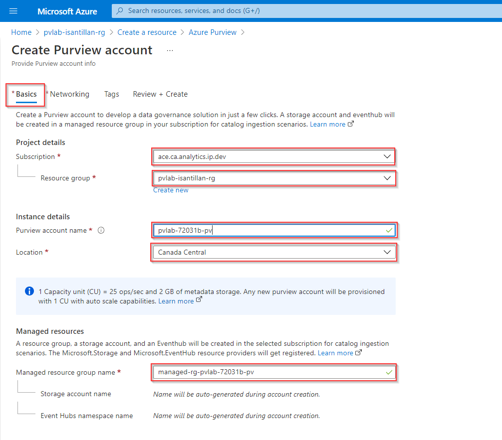

# Module 01 - Create an Azure Purview Account

[< Previous Module](../modules/module00.md) - **[Home](../README.md)** - [Next Module >](../modules/module02a.md)

## :thinking: Prerequisites

* An [Azure account](https://azure.microsoft.com/en-us/free/) with an active subscription.
* Your must have permissions to create resources in your Azure subscription.
* Your subscription must have the following resource providers registered: **Microsoft.Purview**, **Microsoft.Storage**, and **Microsoft.EventHub**. Instructions on how to register a resource provider via the Azure Portal can be found [here](https://docs.microsoft.com/en-us/azure/azure-resource-manager/management/resource-providers-and-types#azure-portal).

## :loudspeaker: Introduction

To create and use the Azure Purview platform, you will need to provision an Azure Purview account.

## :dart: Objectives

* Create an Azure Purview account using the Azure portal.
* Provide additional users access to Azure Purview's data plane.

##  :bookmark_tabs: Table of Contents

| #  | Section | Role |
| --- | --- | --- |
| 1 | [Create an Azure Purview Account](#1-create-an-azure-purview-account) | Azure Administrator |
| 2 | [Grant Access to Azure Purview's Data Plane](#2-grant-access-to-azure-purviews-data-plane) | Collection Administrator |

<a href="#module-01---create-an-azure-purview-account">↥ back to top</a>

## 1. Create an Azure Purview Account

1. Sign in to the [Azure portal](https://portal.azure.com), navigate to the **Home** screen, click **Create a resource**.

      

2. Search the Marketplace for "Azure Purview" and click **Create**.

    

3. Provide the necessary inputs on the **Basics** tab.  

    > Note: The table below provides example values for illustrative purposes only, ensure to specify values that make sense for your deployment. If you have pre-deployed other Azure resources using the lab template, they would have been created with a `randomId`, it is recommended to use the same `randomId` for the Azure Purview account name as per the example below.

    | Parameter  | Example Value |
    | --- | --- |
    | Subscription | `ace.ca.analytics.ip.dev` |
    | Resource group | `pvlab-{yourusername}-rg` |
    | Purview account name | `pvlab-{yourusername}-pv` |
    | Location | `Canada Central` |
    | Managed Resource Group Name | `pvlab-{yourusername}-rg-managed` |

    

    > :bulb: **Did you know?**
    >
    > **Capacity Units** determine the size of the platform and is a **provisioned** (always on) set of resources that is needed to keep the Azure Purview platform up and running. 1 Capacity Unit is able to support approximately 25 data map operations per second and includes up to 2GB of metadata storage about data assets.
    >
    > Capacity Units are required regardless of whether you plan to invoke the Azure Purview API endpoints directly (i.e. ISV scenario) or indirectly via Purview Studio (GUI).
    >
    > Note: With the introduction of the [Elastic Data Map](https://docs.microsoft.com/en-us/azure/purview/concept-elastic-data-map), you no longer need to specify how many Capacity Units that you need. Azure Purview will scale capacity elastically based on the request load.
    > 
    > **vCore Hours** on the other hand, is the unit of measure for **serverless** compute that is needed to run a scan. You only pay per vCore Hour of scanning that you consume (rounded up to the nearest minute).
    >
    > For more information, check out the [Azure Purview Pricing](https://azure.microsoft.com/en-us/pricing/details/azure-purview/) page.

4. On the **Networking** tab, select **All networks**.
   
    

5. On the **Review + Create** tab, once the message in the ribbon returns "Validation passed", verify your selections and click **Create**.

    

6. Wait several minutes while your deployment is in progress. Once complete, click **Go to resource**.

    

<a href="#module-01---create-an-azure-purview-account">↥ back to top</a>

## 2. Grant Access to Azure Purview's Data Plane

1. Navigate to your Azure Purview account and click **Open** within the **Open Purview Studio** tile.

    

2. On the left-hand side, navigate to **Data map**.

    

3. Select **Collections**.

    

    
4. Select **Role assignments**.

    

5. On the right-hand side of **Data curators**, click the **Add** icon.

    

6. Search for another user within your Azure Active Directory, select their account, click **OK**.

    

    > :bulb: **Did you know?**
    >
    > Azure Purview has a set of predefined data plane roles that can be used to control who can access what.
    >
    > For more information, check out [Access control in Azure Purview](https://docs.microsoft.com/en-us/azure/purview/catalog-permissions).

    | Role  | Collections | Catalog | Sources/Scans | Description | 
    | --- | --- | --- | --- | --- |
    | Collection Admin | `Read/Write` | | | Manage collections and role assignments. |
    | Data Reader ||  `Read` |  | Access to catalog (read only). |
    | Data Curator || `Read/Write` |  | Access to catalog (read & write). |
    | Data Source Admin |  || `Read/Write` | Manage data sources and data scans. |

<a href="#module-01---create-an-azure-purview-account">↥ back to top</a>

## :mortar_board: Knowledge Check

[http://aka.ms/purviewlab/q01](http://aka.ms/purviewlab/q01)

1. Which of the following Azure Purview pricing meters is fluid, with consumption varying based on usage?

    A ) Capacity Units  
    B ) vCore Hours  
    C ) Neither

2. Which of the following Azure Purview pricing meters is always on, with consumption based on quantity provisioned?

    A ) Capacity Units  
    B ) vCore Hours  
    C ) Neither

3. Which Azure Purview module provides the base functionality (i.e. source registration, automated scanning and classification, data discovery)?

    A ) C0  
    B ) C1  
    C ) D0

4. Which predefined Azure Purview role provides access to manage data sources?

    A ) Purview Data Reader  
    B ) Purview Data Curator  
    C ) Purview Data Source Administrator

<a href="#module-01---create-an-azure-purview-account">↥ back to top</a>

## :tada: Summary

This module provided an overview of how to provision an Azure Purview account using the Azure Portal and how to grant the appropriate level of access to Azure Purview's data plane.

[Continue >](../modules/module02a.md)
